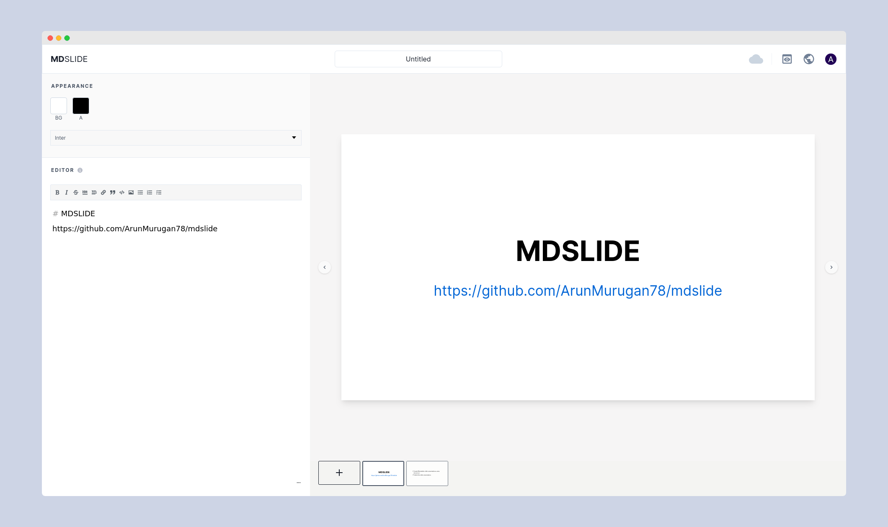
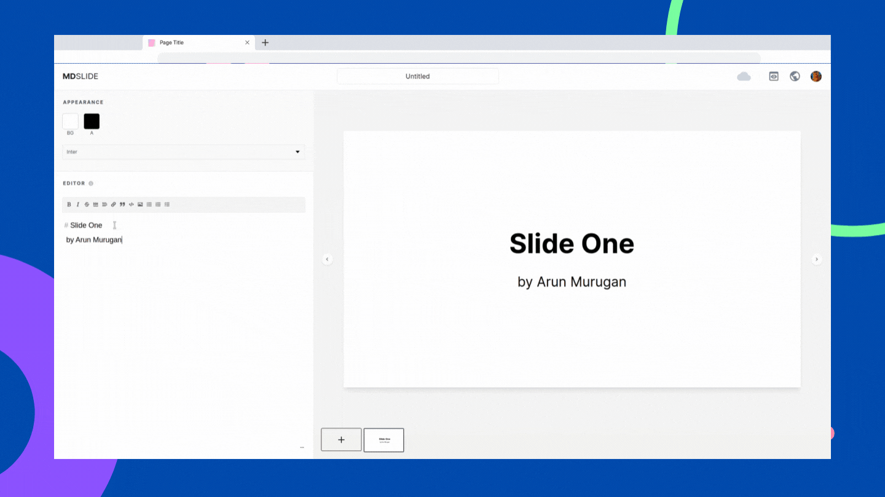

<h1 align="center"><a href="https://mdslide.vercel.app/" target="_blank"> MDSLIDE </a></h1>

<p align="center">
Create Minimalistic Slide Presentations using <i>Markdown</i>.
</p>

<p align="center">
<a href="https://github.com/ArunMurugan78/mdslide/blob/master/LICENSE" target="blank">

</a>
<a href="https://github.com/ArunMurugan78/mdslide/fork" target="blank">

</a>
<a href="https://github.com/ArunMurugan78/mdslide/stargazers" target="blank">

</a>
<a href="https://github.com/ArunMurugan78/mdslide/issues" target="blank">

</a>
<a href="https://github.com/ArunMurugan78/mdslide/pulls" target="blank">

</a>

</p>


<p align="center" style="margin-top: 20px; margin-bottom: 20px">

</p>

>Note: Currently Not supported for Smaller device screens.

Try the App: [MDSLIDE](https://mdslide.vercel.app/) 

## 🚀 Features

+  ⚡ Make Simple yet Effective Slide Presentations using Markdown.
+  🌐  Publish your Slide Presentation.
+  💻  Present your/published Slide presentations in Fullscreen.
+ 🎨  Custom background color, font color and fonts.
+ 😎  Synced to the Cloud automatically. No need to save *manually*!

## Demo



## 👨‍💻 Built with
+ [Nextjs](https://nextjs.org/): for building both the frontend and backend.
+ [Auth0](https://auth0.com/z): Complete User Authentication
+ [MongoDB](https://www.mongodb.com/): to persist data.
+ [Chakra UI](https://chakra-ui.com/): for building UI
+ [Vercel](https://vercel.com/): for hosting
+ [Zustand](https://zustand.surge.sh): react state management  
+ [@uiw/react-md-editor](https://uiwjs.github.io/react-md-editor/): react markdown editor
+ [swr](https://swr.vercel.app/): for fetching data from the backend api
+ [react-window](react-window.now.sh/): virtualize the slide navigator list
+ [next-pwa](https://github.com/shadowwalker/next-pwa): make the next app a [PWA](https://web.dev/progressive-web-apps/)


## 🛠️ Installation Steps

1. Clone the repository

```bash
git clone https://github.com/ArunMurugan78/mdslide.git
```

2. Change the working directory

```bash
cd mdslide
```

3. Install dependencies

```bash
yarn
```

1. Create `.env` file in root and add your variables. You can get the google developer font api key [here](https://developers.google.com/fonts/docs/developer_api). To get the auth0 credentials head over to auth0.com and create a application.

```bash
NEXT_PUBLIC_GOOGLE_FONT_API_KEY=
AUTH0_SECRET=
AUTH0_CLIENT_SECRET=
AUTH0_CLIENT_ID=
AUTH0_ISSUER_BASE_URL=
AUTH0_BASE_URL=
```

5. Run the app

```bash
yarn dev
```

You are all set! Open [localhost:3000](http://localhost:3000/) to see the app.

## ✨ What's next?
+ Upload custom image (Currently only external image links are supported).
+ Collaborative Editing
+ Responsive UI for smaller devices.
+ Resizable editor panel.
+ Optimize web accessiblity.
+ Export as pdf, .html, .pptx

## 🛡 License
This project is licensed under the MIT License.

